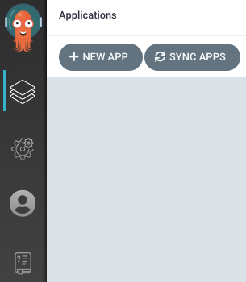
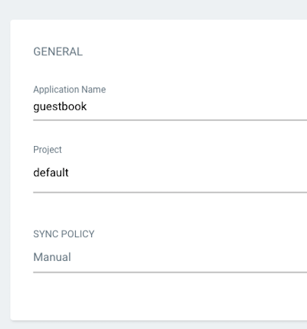
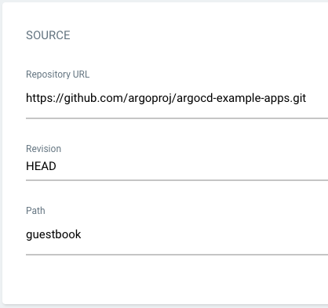
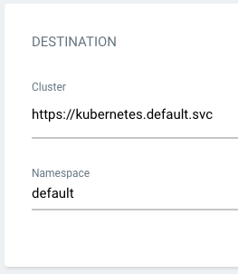
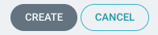
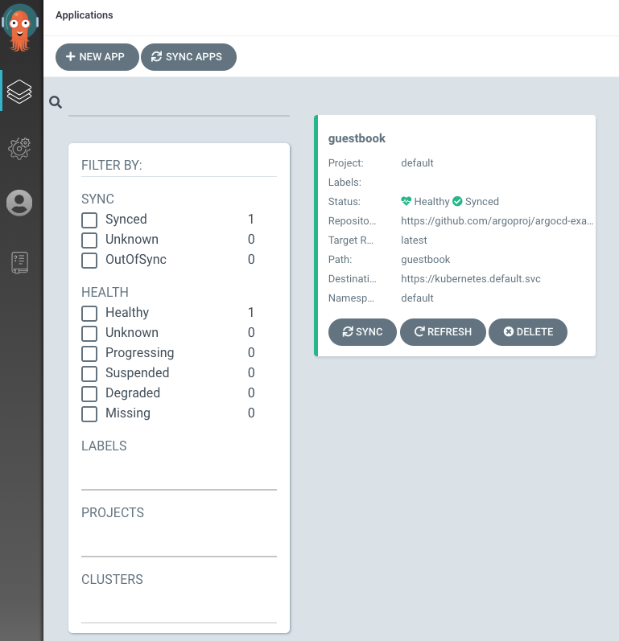
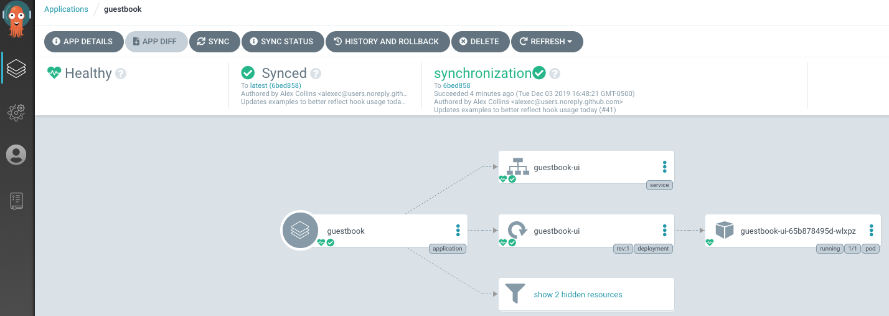

# Argo CD Deployment 

## Requirements

* Installed [kubectl](https://kubernetes.io/docs/tasks/tools/install-kubectl/) command-line tool.
* Installed Minikube [minikube](https://minikube.sigs.k8s.io/docs/start/)

## 1. Install Argo CD

```bash
kubectl create namespace argocd
kubectl apply -n argocd -f crds/
```

## 2. Download Argo CD CLI

Download the latest Argo CD version from [https://github.com/argoproj/argo-cd/releases/latest](https://github.com/argoproj/argo-cd/releases/latest). More detailed installation instructions can be found via the [CLI installation documentation](https://github.com/argoproj/argo-cd/blob/master/docs/cli_installation.md).

## 3. Access The Argo CD API Server

### Port Forwarding
Kubectl port-forwarding can also be used to connect to the API server without exposing the service.

```bash
kubectl port-forward svc/argocd-server -n argocd 8080:443
```

The API server can then be accessed using https://localhost:8080

## 4. Login Using The CLI

Retrieve the password using the below command

```bash
argocd admin initial-password -n argocd
```
Using the username `admin` and the password from above, login to Argo CD running on the localhost.

## 6. Create An Application From A Git Repository


### Creating Apps Via UI

Open a browser to the Argo CD external UI, and login by visiting the IP/hostname in a browser and use the credentials set in step 4.

After logging in, click the **+ New App** button as shown below:



Give your app the name `guestbook`, use the project `default`, and leave the sync policy as `Manual`:



Connect the [https://github.com/argoproj/argocd-example-apps.git](https://github.com/argoproj/argocd-example-apps.git) repo to Argo CD by setting repository url to the github repo url, leave revision as `HEAD`, and set the path to `guestbook`:



For **Destination**, set cluster URL to `https://kubernetes.default.svc` (or `in-cluster` for cluster name) and namespace to `default`:



After filling out the information above, click **Create** at the top of the UI to create the `guestbook` application:



### Syncing via UI



